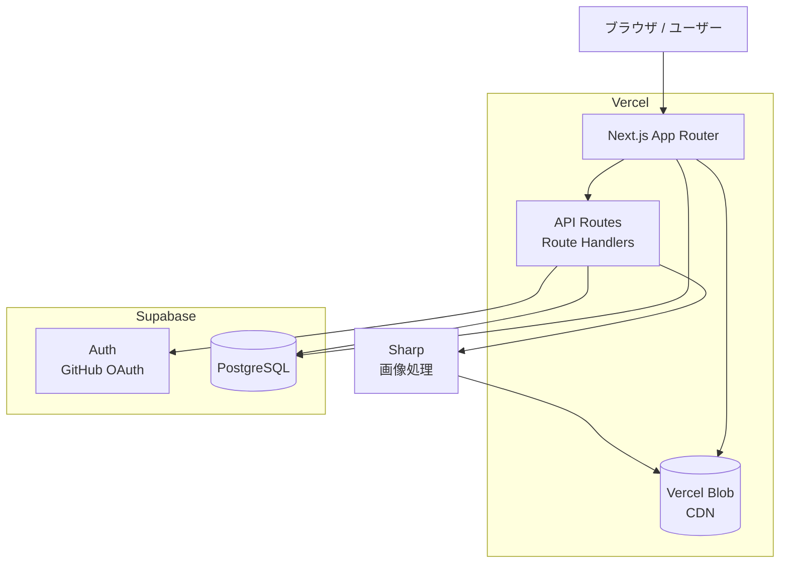
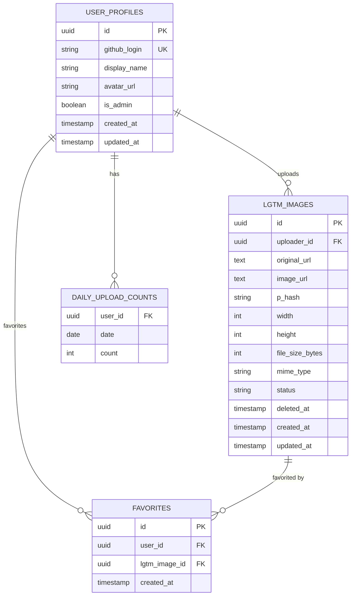
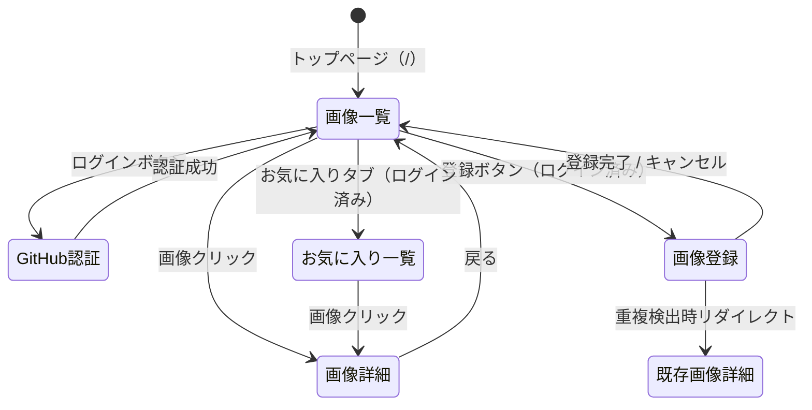
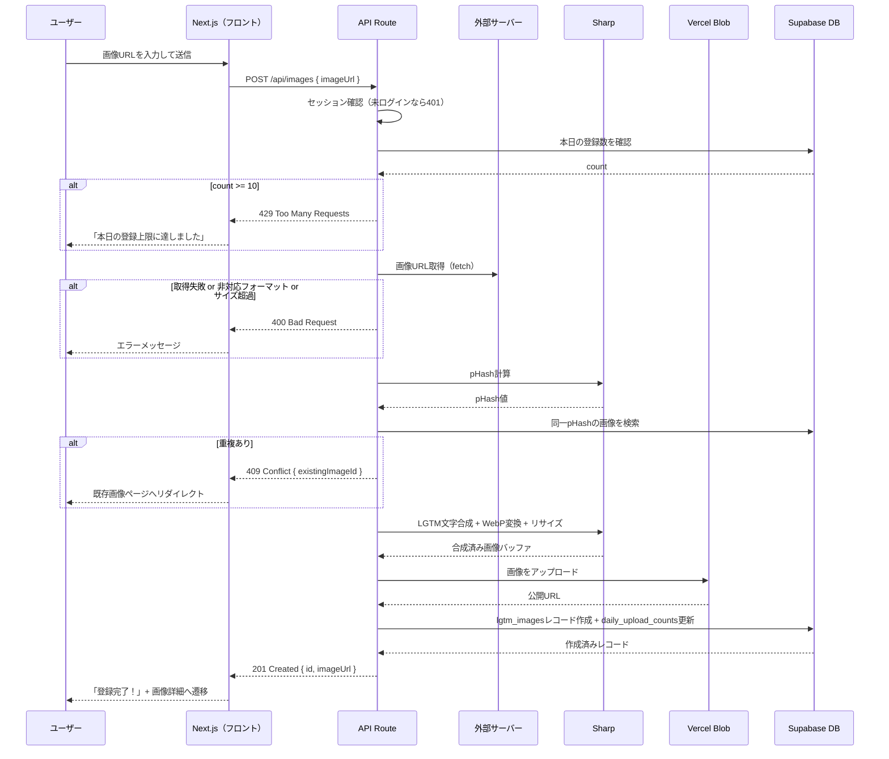

# 機能設計書 (Functional Design Document)

## システム構成図



---

## 技術スタック

| 分類 | 技術 | 選定理由 |
|------|------|----------|
| フレームワーク | Next.js 15（App Router） | SSR・APIルートを一体化、Vercelと親和性が高い |
| 言語 | TypeScript | 型安全性、エディタサポート |
| DB・認証 | Supabase（PostgreSQL + Auth） | GitHub OAuthが標準対応、RLSでセキュアなアクセス制御、無料枠あり |
| ストレージ | Vercel Blob | Vercelと統合済み、CDN配信が自動、無料枠あり |
| 画像処理 | Sharp | Node.js上でLGTM文字合成・WebP変換・リサイズを高速処理 |
| スタイリング | Tailwind CSS | ユーティリティクラスで高速にUI構築 |
| パッケージ管理 | npm | CLAUDE.mdで指定済み |

---

## データモデル定義

### エンティティ: User

Supabase Authが管理するユーザー情報を補完するプロフィールテーブル。

```typescript
interface UserProfile {
  id: string;          // Supabase Auth の UUID（auth.users.id と一致）
  githubLogin: string; // GitHubのユーザー名
  displayName: string; // 表示名（GitHub display name）
  avatarUrl: string;   // GitHubアバター画像URL
  isAdmin: boolean;    // 管理者フラグ
  createdAt: Date;
  updatedAt: Date;
}
```

**制約**:
- `id` は `auth.users.id` への外部キー
- `githubLogin` はUNIQUE制約

---

### エンティティ: LgtmImage

登録済みのLGTM画像。

```typescript
interface LgtmImage {
  id: string;           // UUID
  uploaderId: string;   // UserProfile.id（登録者）
  originalUrl: string;  // 元画像のURL（登録時に指定したURL）
  imageUrl: string;     // Vercel Blobに保存されたLGTM合成済み画像のURL
  pHash: string;        // 知覚ハッシュ（重複チェック用）
  width: number;        // 幅（px）
  height: number;       // 高さ（px）
  fileSizeBytes: number;
  mimeType: 'image/webp';
  status: 'processing' | 'active' | 'deleted';
  deletedAt: Date | null;
  createdAt: Date;
  updatedAt: Date;
}
```

**制約**:
- `pHash` にINDEX（重複チェック時の検索用）
- `status = 'deleted'` の場合は一覧に表示しない（論理削除）
- `uploaderId` は `user_profiles.id` への外部キー

---

### エンティティ: Favorite

ユーザーのお気に入り登録。

```typescript
interface Favorite {
  id: string;
  userId: string;       // UserProfile.id
  lgtmImageId: string;  // LgtmImage.id
  createdAt: Date;
}
```

**制約**:
- `(userId, lgtmImageId)` にUNIQUE制約（同一画像の二重お気に入りを防止）

---

### エンティティ: DailyUploadCount

1日の投稿数制限チェック用。

```typescript
interface DailyUploadCount {
  userId: string;   // UserProfile.id
  date: string;     // 'YYYY-MM-DD' 形式
  count: number;    // その日の登録数
}
```

**制約**:
- `(userId, date)` にUNIQUE制約
- `count` の上限は10（アプリケーションレベルで制御）

---

### ER図



---

## 画面遷移図



---

## API設計

### 画像一覧取得

```
GET /api/images
```

**クエリパラメータ**:
| パラメータ | 型 | デフォルト | 説明 |
|-----------|----|-----------|----|
| `cursor` | string | - | ページネーション用カーソル（`createdAt` ISO文字列） |
| `limit` | number | 20 | 取得件数（最大50） |

**レスポンス**:
```json
{
  "images": [
    {
      "id": "uuid",
      "imageUrl": "https://...",
      "uploaderId": "uuid",
      "createdAt": "2026-05-02T00:00:00Z"
    }
  ],
  "nextCursor": "2026-05-01T23:59:59Z"
}
```

**エラーレスポンス**:
- 400 Bad Request: limitが不正な値

---

### 画像登録

```
POST /api/images
```

**認証**: 必須（Supabaseセッション）

**リクエスト**:
```json
{
  "imageUrl": "https://example.com/image.jpg"
}
```

**処理フロー**（後述のシーケンス図を参照）

**レスポンス**:
```json
{
  "id": "uuid",
  "imageUrl": "https://blob.vercel-storage.com/..."
}
```

**エラーレスポンス**:
- 400 Bad Request: URLが無効、対応外フォーマット、ファイルサイズ超過
- 401 Unauthorized: 未ログイン
- 409 Conflict: 重複画像あり（`existingImageId` を返す）
- 429 Too Many Requests: 1日の登録上限（10枚）超過
- 500 Internal Server Error: 画像取得・合成失敗

---

### 画像削除

```
DELETE /api/images/:id
```

**認証**: 必須（自分が登録した画像 or 管理者）

**レスポンス**: `204 No Content`

**エラーレスポンス**:
- 401 Unauthorized: 未ログイン
- 403 Forbidden: 自分の画像でない（管理者以外）
- 404 Not Found: 画像が存在しない

---

### お気に入り追加（PRD機能 4-A）

```
POST /api/favorites
```

**認証**: 必須

**リクエスト**:
```json
{
  "lgtmImageId": "uuid"
}
```

**レスポンス**:
```json
{
  "id": "uuid",
  "lgtmImageId": "uuid"
}
```

**エラーレスポンス**:
- 401 Unauthorized: 未ログイン
- 404 Not Found: 画像が存在しない
- 409 Conflict: すでにお気に入り登録済み

---

### お気に入り解除（PRD機能 4-A）

```
DELETE /api/favorites/:lgtmImageId
```

**認証**: 必須

**レスポンス**: `204 No Content`

---

### お気に入り一覧取得（PRD機能 4-B）

```
GET /api/favorites
```

**認証**: 必須（自分のお気に入りのみ）

**レスポンス**:
```json
{
  "images": [
    {
      "id": "uuid",
      "imageUrl": "https://...",
      "createdAt": "2026-05-02T00:00:00Z"
    }
  ]
}
```

---

## ユースケース: 画像登録フロー



---

## アルゴリズム設計: 重複チェック（pHash）

### 目的

同一または酷似した画像の重複登録を防ぎ、一覧の多様性を維持する。

### 処理フロー

#### ステップ1: pHash計算

```typescript
async function calculatePHash(imageBuffer: Buffer): Promise<string> {
  // 32x32のグレースケール画像にリサイズ
  const resized = await sharp(imageBuffer)
    .resize(32, 32, { fit: 'fill' })
    .grayscale()
    .raw()
    .toBuffer();

  // 全ピクセルの平均値を計算
  const pixels = new Uint8Array(resized);
  const avg = pixels.reduce((sum, v) => sum + v, 0) / pixels.length;

  // 各ピクセルが平均以上なら1、未満なら0のビット列を生成
  return Array.from(pixels)
    .map(v => (v >= avg ? '1' : '0'))
    .join('');
}
```

#### ステップ2: ハミング距離による類似判定

```typescript
function hammingDistance(hash1: string, hash2: string): number {
  return hash1.split('').filter((bit, i) => bit !== hash2[i]).length;
}

// 閾値: 10（32x32=1024ビット中10ビット以内の差異は同一とみなす）
const DUPLICATE_THRESHOLD = 10;

function isDuplicate(newHash: string, existingHash: string): boolean {
  return hammingDistance(newHash, existingHash) <= DUPLICATE_THRESHOLD;
}
```

#### ステップ3: DB検索との組み合わせ

DBには全ての`pHash`を保存し、新規登録時に全件と比較する。
画像数が増えた場合はpgvector等への移行を検討する（現時点はスコープ外）。

---

## アルゴリズム設計: LGTM文字合成

### 目的

登録画像に白文字+黒縁の「LGTM」を合成し、どんな背景でも読めるようにする。

### 処理フロー

```typescript
async function composeLgtmImage(imageBuffer: Buffer): Promise<Buffer> {
  const metadata = await sharp(imageBuffer).metadata();
  const { width = 1200, height = 800 } = metadata;

  // リサイズ（幅1200px以内）
  const resizeWidth = Math.min(width, 1200);

  // SVGでLGTM文字を生成（白文字+黒縁）
  const fontSize = Math.floor(resizeWidth * 0.15);
  const svgText = `
    <svg width="${resizeWidth}" height="${Math.floor(height * (resizeWidth / width))}">
      <text
        x="50%" y="50%"
        dominant-baseline="middle"
        text-anchor="middle"
        font-family="Arial Black, sans-serif"
        font-size="${fontSize}"
        font-weight="900"
        fill="white"
        stroke="black"
        stroke-width="${Math.floor(fontSize * 0.08)}"
        paint-order="stroke"
      >LGTM</text>
    </svg>
  `;

  return sharp(imageBuffer)
    .resize(resizeWidth)
    .composite([{ input: Buffer.from(svgText), blend: 'over' }])
    .webp({ quality: 85 })
    .toBuffer();
}
```

---

## UI設計

### 画像一覧画面

**レイアウト**: レスポンシブグリッド
- PC（1280px以上）: 4カラム
- タブレット（768px以上）: 3カラム
- モバイル: 2カラム

**各カード表示項目**:
| 項目 | 説明 |
|------|------|
| LGTM合成済み画像 | `object-cover` でトリミング表示 |
| マークダウンコピーボタン | クリックでクリップボードにコピー、完了後「コピーしました✓」に変化（2秒後に戻る） |
| お気に入りボタン | ハートアイコン、ログイン済みのみ表示 |

**ナビゲーション**:
- ヘッダー: サービスロゴ / 「画像を登録する」ボタン（ログイン時）/ ログイン・ログアウトボタン
- タブ: 「すべての画像」「お気に入り」（ログイン時のみお気に入りタブ表示）

### 画像登録画面

```
┌─────────────────────────────────────┐
│ 画像URLを入力してください              │
│ ┌───────────────────────────────┐   │
│ │ https://example.com/image.jpg │   │
│ └───────────────────────────────┘   │
│ [キャンセル]  [登録する →]           │
│                                     │
│  ⚠ 1日10枚まで登録できます（残り 8枚）│
└─────────────────────────────────────┘
```

### マークダウンリンクのフォーマット

```markdown

```

---

## コンポーネント設計

### ページ構成（App Router）

```
app/
├── page.tsx                    # 画像一覧（トップページ）
├── images/
│   ├── [id]/page.tsx           # 画像詳細
│   └── new/page.tsx            # 画像登録フォーム
├── favorites/page.tsx          # お気に入り一覧
└── api/
    ├── images/
    │   ├── route.ts            # GET（一覧）/ POST（登録）
    │   └── [id]/route.ts       # DELETE（削除）
    └── favorites/
        ├── route.ts            # GET（一覧）/ POST（追加）
        └── [lgtmImageId]/route.ts  # DELETE（解除）
```

### サーバーサイドサービス

**ImageService**（`src/services/image-service.ts`）

```typescript
class ImageService {
  // 画像一覧を取得（カーソルページネーション）
  listImages(cursor?: string, limit?: number): Promise<LgtmImage[]>;

  // 画像を登録（ダウンロード→合成→保存→DB登録）
  createImage(uploaderId: string, imageUrl: string): Promise<LgtmImage>;

  // 画像を削除（権限チェック込み）
  deleteImage(imageId: string, requesterId: string): Promise<void>;
}
```

**FavoriteService**（`src/services/favorite-service.ts`）

```typescript
class FavoriteService {
  // お気に入り一覧を取得
  listFavorites(userId: string): Promise<LgtmImage[]>;

  // お気に入りに追加
  addFavorite(userId: string, lgtmImageId: string): Promise<Favorite>;

  // お気に入りから削除
  removeFavorite(userId: string, lgtmImageId: string): Promise<void>;
}
```

---

## セキュリティ考慮事項

| 脅威 | 対策 |
|------|------|
| SSRF（外部URL取得時） | プライベートIPレンジ（10.0.0.0/8, 172.16.0.0/12, 192.168.0.0/16, 127.0.0.0/8）へのリクエストをブロック |
| 不正な画像形式 | Sharpのメタデータ検証でMIMEタイプを確認（JPEG/PNG/GIFのみ許可） |
| 他ユーザーの画像削除 | APIレベルで `uploaderId === requesterId` を検証（Supabase RLSでも二重チェック） |
| 1日10枚制限の回避 | `daily_upload_counts` をDB側でatomicにインクリメント |
| セッション偽装 | Supabase Auth JWTを全APIルートで検証 |

### Supabase RLS ポリシー

```sql
-- lgtm_images: 閲覧は全員OK、登録は本人のみ、削除は本人または管理者
CREATE POLICY "anyone can view active images"
  ON lgtm_images FOR SELECT
  USING (status = 'active');

CREATE POLICY "authenticated users can insert"
  ON lgtm_images FOR INSERT
  WITH CHECK (auth.uid() = uploader_id);

CREATE POLICY "owner or admin can delete"
  ON lgtm_images FOR UPDATE
  USING (auth.uid() = uploader_id OR EXISTS (
    SELECT 1 FROM user_profiles WHERE id = auth.uid() AND is_admin = true
  ));

-- favorites: 自分のお気に入りのみ操作可能
CREATE POLICY "users can manage own favorites"
  ON favorites
  USING (auth.uid() = user_id)
  WITH CHECK (auth.uid() = user_id);
```

---

## エラーハンドリング

| エラー種別 | 処理 | ユーザーへの表示 |
|-----------|------|-----------------|
| 画像URLが無効（404等） | 処理中断 | 「画像を取得できませんでした。URLを確認してください」 |
| 非対応フォーマット | 処理中断 | 「JPEG・PNG・GIF形式の画像URLを入力してください」 |
| ファイルサイズ超過（10MB超） | 処理中断 | 「10MB以下の画像を使用してください」 |
| 重複画像 | 既存画像へリダイレクト | 「同じ画像がすでに登録されています」 |
| 1日の登録上限超過 | 処理中断 | 「本日の登録上限（10枚）に達しました。明日また試してください」 |
| 未ログイン状態での登録 | ログインへリダイレクト | 「画像の登録にはログインが必要です」 |
| Vercel Blob保存失敗 | ロールバック・処理中断 | 「画像の保存に失敗しました。しばらく経ってから再試行してください」 |
| SSRF検出 | 処理中断 | 「このURLは使用できません」 |

---

## テスト戦略

### ユニットテスト

- `calculatePHash()`: 同一画像と異なる画像でのハッシュ比較
- `hammingDistance()`: ビット列の差異計算
- `composeLgtmImage()`: 合成画像のメタデータ検証（WebP形式、幅1200px以内）
- SSRF検証ロジック: プライベートIPがブロックされること

### 統合テスト

- `POST /api/images`: 正常登録・重複検出・上限超過・SSRF・未ログイン
- `DELETE /api/images/:id`: 本人削除・他人削除（403）・管理者削除
- `POST /api/favorites` / `DELETE /api/favorites/:id`: 追加・解除・重複追加（409）

### E2Eテスト

- 未ログインユーザーが画像一覧を閲覧し、マークダウンをコピーできる
  - **ユーザビリティ検証**: トップページ到達 → 画像クリック → コピーボタンクリック → コピー完了確認 が **5ステップ以内・ページ遷移なし** で完結すること（PRD非機能要件「5分以内に基本操作を習得」を担保）
- ログイン済みユーザーが画像URLを登録し、一覧に表示される
- ログイン済みユーザーがお気に入りに追加・解除できる（PRD機能 4-A）
- ログイン済みユーザーがお気に入り一覧画面で自分のお気に入り画像のみを閲覧できる（PRD機能 4-B）
- 自分の画像を削除すると一覧から消える
