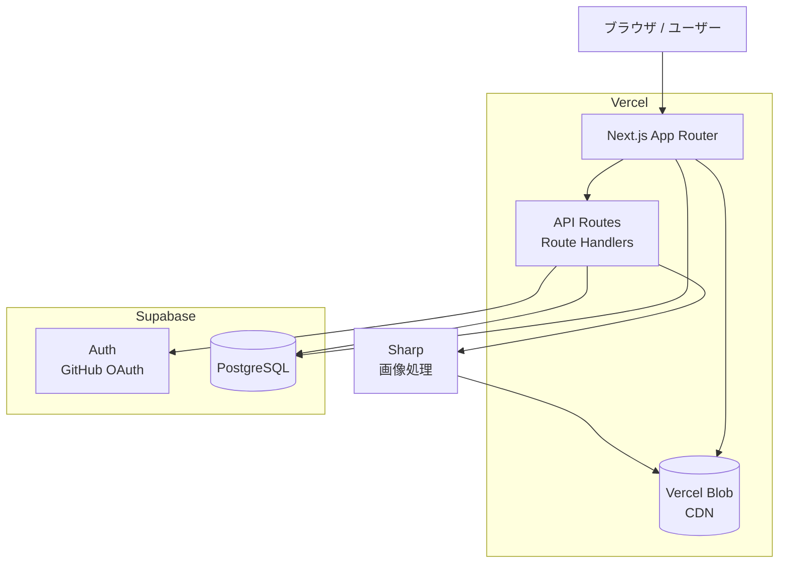
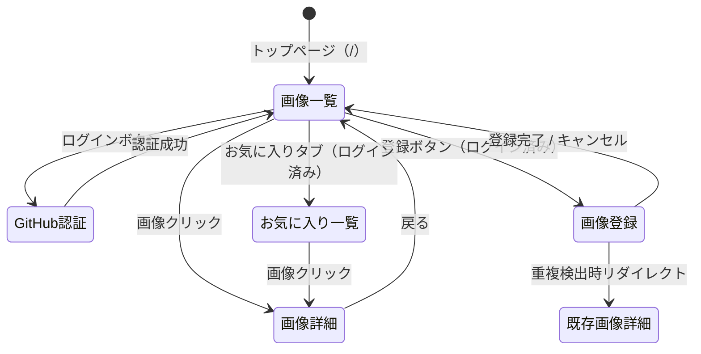
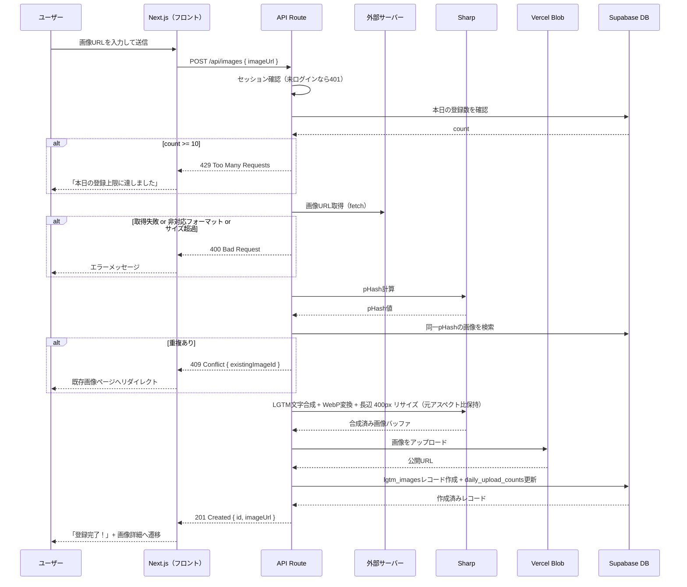

# 機能設計書 (Functional Design Document)

## システム構成図



---

## 技術スタック

技術選定の詳細（バージョン・選定理由）は [`docs/architecture.md`](./architecture.md) の「テクノロジースタック」を正とする。本ドキュメントでは各コンポーネントの機能設計上の役割（システム構成図参照）のみ扱う。

---

## データモデル定義

### エンティティ: User

Supabase Authが管理するユーザー情報を補完するプロフィールテーブル。

```typescript
interface UserProfile {
  id: string;          // Supabase Auth の UUID（auth.users.id と一致）
  githubLogin: string; // GitHubのユーザー名
  displayName: string; // 表示名（GitHub display name）
  avatarUrl: string;   // GitHubアバター画像URL
  isAdmin: boolean;    // 管理者フラグ
  createdAt: Date;
  updatedAt: Date;
}
```

**制約**:
- `id` は `auth.users.id` への外部キー
- `githubLogin` はUNIQUE制約

---

### エンティティ: LgtmImage

登録済みのLGTM画像。

```typescript
interface LgtmImage {
  id: string;           // UUID
  uploaderId: string;   // UserProfile.id（登録者）
  originalUrl: string;  // 元画像のURL（登録時に指定したURL）
  imageUrl: string;     // Vercel Blobに保存されたLGTM合成済み画像のURL
  pHash: string;        // 知覚ハッシュ（重複チェック用）
  width: number;        // 幅（px）
  height: number;       // 高さ（px）
  fileSizeBytes: number;
  mimeType: 'image/webp';
  status: 'processing' | 'active' | 'deleted';
  deletedAt: Date | null;
  createdAt: Date;
  updatedAt: Date;
}
```

**制約**:
- `pHash` にINDEX（重複チェック時の検索用）
- `status = 'deleted'` の場合は一覧に表示しない（論理削除）
- `uploaderId` は `user_profiles.id` への外部キー

**`status` のライフサイクルとUI表示ルール**:
- `active`: 公開可能な状態。**画像一覧 / お気に入り一覧APIは `active` のみを返す**（RLSポリシーで担保）。MVP の画像登録 API は合成・Blob 保存・DB INSERT を同期で完了させ、`active` で直接 INSERT する
- `processing`: 将来の非同期アップロードパイプライン (例: ジョブキュー化・大容量ファイル対応) のために予約された中間状態。MVP では使用しない（CHECK 制約のみ存在）
- `deleted`: 論理削除済み。一覧・詳細APIともに 404 として扱う

UI 側ではAPI 登録レスポンス（201）= `active` 確定とみなして遷移する。`processing` を運用に組み込む際は、画像一覧 API のフィルタ・RLS ポリシー・本セクションの記述を併せて更新すること。

---

### エンティティ: Favorite

ユーザーのお気に入り登録。

```typescript
interface Favorite {
  id: string;
  userId: string;       // UserProfile.id
  lgtmImageId: string;  // LgtmImage.id
  createdAt: Date;
}
```

**制約**:
- `(userId, lgtmImageId)` にUNIQUE制約（同一画像の二重お気に入りを防止）

---

### エンティティ: DailyUploadCount

1日の投稿数制限チェック用。

```typescript
interface DailyUploadCount {
  userId: string;   // UserProfile.id（複合主キーの一部）
  date: string;     // 'YYYY-MM-DD' 形式（複合主キーの一部）
  count: number;    // その日の登録数
}
```

**制約**:
- 主キー: `(userId, date)` の複合主キー（独立した `id` カラムは持たない）
- `userId` は `user_profiles.id` への外部キー
- `count` の上限は10（アプリケーションレベルで制御）
- UPSERT による atomic な INCREMENT を行う（マイグレーションで `ON CONFLICT (user_id, date) DO UPDATE` を利用）

---

### ER図


---

## 画面遷移図



---

## API設計

### 画像一覧取得

```
GET /api/images
```

**クエリパラメータ**:
| パラメータ | 型 | デフォルト | 説明 |
|-----------|----|-----------|----|
| `cursor` | string | - | ページネーション用カーソル（`createdAt` ISO文字列） |
| `limit` | number | 16 | 取得件数（最大50、デフォルトは `LIST_IMAGES_DEFAULT_LIMIT`） |

**レスポンス**:
```json
{
  "images": [
    {
      "id": "uuid",
      "imageUrl": "https://...",
      "uploaderId": "uuid",
      "createdAt": "2026-05-02T00:00:00Z"
    }
  ],
  "nextCursor": "2026-05-01T23:59:59Z"
}
```

**フィールド絞り込み方針**:
- 一覧 API は CDN 経由の画像表示と「コピー / お気に入り」操作だけを満たせばよいため、`imageUrl` と `id` を中心に最小フィールドのみ返す
- `width` / `height` は画像詳細ページ (`/images/[id]`) で `next/image` の `width` / `height` 属性に流し込み、実画像比率を保ちながら CLS を防ぐために公開する。一覧 API も詳細ページ用と整合させて同じフィールドを返す
- `pHash` / `fileSizeBytes` は内部用途専用で公開しない
- 投稿者の表示名・アバターは MVP の一覧UIでは表示しない方針（PRD「画像一覧画面」受け入れ条件参照）。将来的に必要になった場合は `GET /api/users/:id` を別途追加するか、本APIのレスポンスに `uploader: { displayName, avatarUrl }` を拡張する

**エラーレスポンス**:
- 400 Bad Request: limitが不正な値

---

### 画像ランダム取得（Issue #109）

```
GET /api/images/random
```

全 `active` 画像からサーバーサイドでランダムに最大 `LIST_IMAGES_DEFAULT_LIMIT`（16）枚を抽出して返す。一覧画面先頭の「ランダム表示」ボタンが押下時のみ呼び出す。

**クエリパラメータ**: なし（抽出件数は #108 の共通定数 `LIST_IMAGES_DEFAULT_LIMIT` に固定）

**レスポンス**:
```json
{
  "images": [
    {
      "id": "uuid",
      "imageUrl": "https://...",
      "uploaderId": "uuid",
      "width": 266,
      "height": 199,
      "createdAt": "2026-05-02T00:00:00Z"
    }
  ]
}
```

**設計メモ**:
- ランダム表示は 16 枚で完結するため `nextCursor` を返さない（カーソルは `created_at` 基準でランダム順と不整合）。「もっと読み込む」は UI 側でも描画しない。
- 抽出方式は「全 active id を取得 → サーバーで Fisher-Yates シャッフル → 先頭 N 件の本体を取得」。新規 migration / DB 型再生成が不要で影響範囲が最小。データ規模が 10 万件超に達した場合は RPC（`order by random()`）/ pgvector ベースへの移行を検討する（pHash 全件比較と同じ判断基準）。
- 押下のたびに別の組み合わせを返すため、ルート単位・レスポンス双方でキャッシュさせない（`Cache-Control: no-store` / `dynamic = 'force-dynamic'`）。
- ランダム状態はクライアントの一時状態。リロード・再訪問で通常表示（新着順 16 枚 + もっと読み込む）へ自動的に戻る。

**エラーレスポンス**:
- 500 Internal Server Error: サーバー内部エラー

---

### 画像登録

```
POST /api/images
```

**認証**: 必須（Supabaseセッション）

**リクエスト**:
```json
{
  "imageUrl": "https://example.com/image.jpg"
}
```

**処理フロー**:

1. セッション確認（未ログインなら 401）
2. 当日の登録枚数チェック（10枚以上なら 429）
3. 外部URL取得・SSRF検証・フォーマット/サイズ検証（失敗なら 400）
4. pHash計算 → DB全件と比較し重複検出（重複なら 409・`existingImageId`を返却）
5. LGTM文字合成 + WebP変換 + 長辺 400px にリサイズ（元アスペクト比保持）。アニメーションGIF入力 (フレーム数 ≤ 150) は全フレームに同じ LGTM 文字を焼き込んだアニメーション WebP として保存し、`is_animated = true` で記録する
6. Vercel Blob にアップロード
7. `lgtm_images` レコード作成 + `daily_upload_counts` を atomic にインクリメント

詳細は本ドキュメント末尾の「ユースケース: 画像登録フロー」シーケンス図を参照。

**レスポンス**:
```json
{
  "id": "uuid",
  "imageUrl": "https://blob.vercel-storage.com/..."
}
```

**エラーレスポンス**:
- 400 Bad Request: URLが無効、対応外フォーマット、ファイルサイズ超過
- 401 Unauthorized: 未ログイン
- 409 Conflict: 重複画像あり（`existingImageId` を返す）
- 429 Too Many Requests: 1日の登録上限（10枚）超過
- 500 Internal Server Error: 画像取得・合成失敗

---

### 画像削除

```
DELETE /api/images/:id
```

**認証**: 必須（自分が登録した画像 or 管理者）

**処理フロー**:

| 操作者 | 削除種別 | 挙動 |
|--------|---------|------|
| 自分の画像のオーナー（PRD機能2） | 論理削除のみ | `status = 'deleted'`・`deletedAt` 更新。Blob は残置（30日後にPRD機能8で物理削除） |
| 管理者（PRD機能6 / P1） | 論理削除 + 即時物理削除 | `status = 'deleted'`・`deletedAt` 更新後、Vercel Blob `del()` を即時実行。30日待機ルールの例外。管理者操作ログを記録 |

管理者削除のフラグは `user_profiles.is_admin` で判定し、Service 層内で分岐する。

**レスポンス**: `204 No Content`

**エラーレスポンス**:
- 401 Unauthorized: 未ログイン
- 403 Forbidden: 自分の画像でない（管理者以外）
- 404 Not Found: 画像が存在しない
- 500 Internal Server Error: 管理者削除時のBlob物理削除に失敗（DBの論理削除はロールバックする）

---

### お気に入り追加（PRD機能 4-A）

```
POST /api/favorites
```

**認証**: 必須

**リクエスト**:
```json
{
  "lgtmImageId": "uuid"
}
```

**レスポンス**:
```json
{
  "id": "uuid",
  "lgtmImageId": "uuid"
}
```

**エラーレスポンス**:
- 401 Unauthorized: 未ログイン
- 404 Not Found: 画像が存在しない
- 409 Conflict: すでにお気に入り登録済み

---

### お気に入り解除（PRD機能 4-A）

```
DELETE /api/favorites/:lgtmImageId
```

**認証**: 必須

**レスポンス**: `204 No Content`

**エラーレスポンス**:
- 401 Unauthorized: 未ログイン
- 404 Not Found: 当該ユーザーの該当お気に入りが存在しない（既に解除済みも含む）

**冪等性**: 同一URLへの DELETE は冪等として扱う。「すでに解除済み」のケースは 404 を返却し、UIはこれをエラー扱いせずに「解除済み」と表示する。

---

### お気に入り一覧取得（PRD機能 4-B）

```
GET /api/favorites
```

**認証**: 必須（自分のお気に入りのみ）

**クエリパラメータ**:
| パラメータ | 型 | デフォルト | 説明 |
|-----------|----|-----------|----|
| `cursor` | string | - | ページネーション用カーソル（`favorites.created_at` ISO文字列） |
| `limit` | number | 20 | 取得件数（最大50） |

**レスポンス**:
```json
{
  "images": [
    {
      "id": "uuid",
      "imageUrl": "https://...",
      "createdAt": "2026-05-02T00:00:00Z"
    }
  ],
  "nextCursor": "2026-05-01T23:59:59Z"
}
```

`createdAt` は **お気に入り登録日時**（`favorites.created_at`）を返す。画像の登録日時ではない点に注意（一覧の並び順がお気に入り追加順となるため）。

**エラーレスポンス**:
- 400 Bad Request: `limit` が不正な値
- 401 Unauthorized: 未ログイン

---

## ユースケース: 画像登録フロー



---

## アルゴリズム設計: 重複チェック（pHash）

### 目的

同一または酷似した画像の重複登録を防ぎ、一覧の多様性を維持する。

### 処理フロー

#### ステップ1: pHash計算

```typescript
async function calculatePHash(imageBuffer: Buffer): Promise<string> {
  // 32x32のグレースケール画像にリサイズ
  const resized = await sharp(imageBuffer)
    .resize(32, 32, { fit: 'fill' })
    .grayscale()
    .raw()
    .toBuffer();

  // 全ピクセルの平均値を計算
  const pixels = new Uint8Array(resized);
  const avg = pixels.reduce((sum, v) => sum + v, 0) / pixels.length;

  // 各ピクセルが平均以上なら1、未満なら0のビット列を生成
  return Array.from(pixels)
    .map(v => (v >= avg ? '1' : '0'))
    .join('');
}
```

#### ステップ2: ハミング距離による類似判定

```typescript
function hammingDistance(hash1: string, hash2: string): number {
  return hash1.split('').filter((bit, i) => bit !== hash2[i]).length;
}

// 閾値: 10（32x32=1024ビット中10ビット以内の差異は同一とみなす）
const DUPLICATE_THRESHOLD = 10;

function isDuplicate(newHash: string, existingHash: string): boolean {
  return hammingDistance(newHash, existingHash) <= DUPLICATE_THRESHOLD;
}
```

#### ステップ3: DB検索との組み合わせ

DBには全ての`pHash`を保存し、新規登録時に **`status='active'` の全件** と比較する。論理削除済み (`status='deleted'`) 画像との重複は許容する（ユーザー導線上参照できないため、再登録できる方が UX として自然）。
画像数が増えた場合はpgvector等への移行を検討する（現時点はスコープ外）。

---

## アルゴリズム設計: LGTM文字合成

### 目的

登録画像に白文字+黒縁の「LGTM」を合成し、どんな背景でも読めるようにする。

### 処理フロー

> 実装詳細は `src/lib/image/compose-lgtm.ts` を参照。以下は概要を示す擬似コード。

```typescript
const MAX_LONG_SIDE = 400;

async function composeLgtmImage(imageBuffer: Buffer): Promise<Buffer> {
  // 1. 原画サイズを取得
  const { width, height } = await sharp(imageBuffer).metadata();

  // 2. 長辺を MAX_LONG_SIDE に揃える（元アスペクト比保持・原画 < MAX は拡大しない）
  //    短辺は floor で切り捨て
  let targetWidth = width;
  let targetHeight = height;
  if (Math.max(width, height) > MAX_LONG_SIDE) {
    if (width >= height) {
      targetWidth = MAX_LONG_SIDE;
      targetHeight = Math.floor((height * MAX_LONG_SIDE) / width);
    } else {
      targetHeight = MAX_LONG_SIDE;
      targetWidth = Math.floor((width * MAX_LONG_SIDE) / height);
    }
  }

  // 3. opentype.js でアウトラインから SVG <path> を生成し、白文字+黒縁の LGTM オーバーレイを構築
  //    fontSize は出力 width に応じて可変 (Math.max(24, Math.floor(targetWidth * 0.15)))
  //    Vercel サーバレスでは Pango+fontconfig が効かないため <text> ではなく <path> を使う
  const overlay = await buildLgtmOverlay(targetWidth, targetHeight, 'LGTM');

  // 4. 算出した W/H はアスペクト比を保持済みなので fit: 'fill' でも歪まない
  return sharp(imageBuffer)
    .resize(targetWidth, targetHeight, { fit: 'fill' })
    .composite([{ input: overlay, blend: 'over' }])
    .webp({ quality: 85 })
    .toBuffer();
}
```

---

## UI設計

### 画像一覧画面

**レイアウト**: レスポンシブグリッド
- PC（1280px以上）: 4カラム
- タブレット（768px以上）: 3カラム
- モバイル: 2カラム

**各カード表示項目**:
| 項目 | 説明 |
|------|------|
| LGTM合成済み画像 | `object-cover` でトリミング表示 |
| マークダウンコピーボタン | クリックでクリップボードにコピー、完了後「コピーしました✓」に変化（2秒後に戻る） |
| お気に入りボタン | ハートアイコン、ログイン済みのみ表示 |

**ナビゲーション**:
- ヘッダー: サービスロゴ / 「画像を登録する」ボタン（ログイン時）/ ログイン・ログアウトボタン
- タブ: 「すべての画像」「お気に入り」（ログイン時のみお気に入りタブ表示）

### 画像登録画面

```
┌─────────────────────────────────────┐
│ 画像URLを入力してください              │
│ ┌───────────────────────────────┐   │
│ │ https://example.com/image.jpg │   │
│ └───────────────────────────────┘   │
│ [キャンセル]  [登録する →]           │
│                                     │
│  ⚠ 1日10枚まで登録できます（残り 8枚）│
└─────────────────────────────────────┘
```

### マークダウンリンクのフォーマット

```markdown

```

---

## コンポーネント設計

### ページ構成（App Router）

```
app/
├── (site)/                     # 画面ルートグループ（共通レイアウト）
│   ├── layout.tsx              # ヘッダー等の共通レイアウト
│   ├── page.tsx                # 画像一覧（トップページ）
│   ├── images/
│   │   ├── new/page.tsx        # 画像登録フォーム
│   │   └── [id]/page.tsx       # 画像詳細
│   └── favorites/
│       └── page.tsx            # お気に入り一覧
├── api/
│   ├── auth/
│   │   └── callback/route.ts   # GitHub OAuth コールバック
│   ├── images/
│   │   ├── route.ts            # GET（一覧）/ POST（登録）
│   │   └── [id]/route.ts       # DELETE（削除）
│   └── favorites/
│       ├── route.ts            # GET（一覧）/ POST（追加）
│       └── [lgtmImageId]/route.ts  # DELETE（解除）
└── layout.tsx                  # ルートレイアウト
```

詳細なディレクトリ構造は [`docs/repository-structure.md`](./repository-structure.md) を正典とする。

### サーバーサイドサービス

**ImageService**（`src/services/image-service.ts`）

```typescript
interface ListImagesParams {
  cursor?: string;       // 前ページ末尾の createdAt (ISO 8601 / UTC)
  limit?: number;        // デフォルト 16 (LIST_IMAGES_DEFAULT_LIMIT)、最大 50
}

interface ListImagesResult {
  images: PublicLgtmImage[];   // {id, imageUrl, uploaderId, createdAt} のみ公開
  nextCursor: string | null;   // 次ページが無ければ null
}

class ImageService {
  // 画像一覧を取得（カーソルページネーション・公開フィールドのみ）
  listImages(params?: ListImagesParams): Promise<ListImagesResult>;

  // 画像を登録（ダウンロード→合成→保存→DB登録）
  createImage(uploaderId: string, imageUrl: string): Promise<LgtmImage>;

  // 画像を削除（権限チェック込み）
  deleteImage(imageId: string, requesterId: string): Promise<void>;
}
```

**FavoriteService**（`src/services/favorite-service.ts`）

```typescript
class FavoriteService {
  // お気に入り一覧を取得（カーソルページネーション、お気に入り追加日時の降順）
  listFavorites(userId: string, cursor?: string, limit?: number): Promise<{
    images: LgtmImage[];
    nextCursor: string | null;
  }>;

  // お気に入りに追加
  addFavorite(userId: string, lgtmImageId: string): Promise<Favorite>;

  // お気に入りから削除
  removeFavorite(userId: string, lgtmImageId: string): Promise<void>;
}
```

---

## セキュリティ考慮事項

| 脅威 | 対策 |
|------|------|
| SSRF（外部URL取得時） | プライベートIPレンジ（10.0.0.0/8, 172.16.0.0/12, 192.168.0.0/16, 127.0.0.0/8）へのリクエストをブロック |
| 不正な画像形式 | Sharpのメタデータ検証でMIMEタイプを確認（JPEG/PNG/GIFのみ許可） |
| 他ユーザーの画像削除 | APIレベルで `uploaderId === requesterId` を検証（Supabase RLSでも二重チェック） |
| 1日10枚制限の回避 | `daily_upload_counts` をDB側でatomicにインクリメント |
| セッション偽装 | Supabase Auth JWTを全APIルートで検証 |

### Supabase RLS ポリシー

```sql
-- lgtm_images: 閲覧は全員OK + 所有者・管理者は status を問わず可視、登録は本人のみ、更新 (論理削除含む) は本人または管理者
CREATE POLICY "anyone can view active images"
  ON lgtm_images FOR SELECT
  USING (status = 'active');

-- 所有者は自分が uploader の画像を status を問わず SELECT 可
-- 目的: 論理削除 (status='active' → 'deleted') 時の post-update 可視性チェックを通すため
-- 副作用: アプリ層は WHERE 句で status='active' を強制しているため、一覧/詳細 API に deleted 行は混入しない
CREATE POLICY "owner can view own images"
  ON lgtm_images FOR SELECT
  USING (auth.uid() = uploader_id);

-- 管理者は全ての画像を SELECT 可 (将来の管理者削除/モデレーションの前提)
CREATE POLICY "admin can view all images"
  ON lgtm_images FOR SELECT
  USING (EXISTS (
    SELECT 1 FROM user_profiles WHERE id = auth.uid() AND is_admin = true
  ));

CREATE POLICY "authenticated users can insert own images"
  ON lgtm_images FOR INSERT
  WITH CHECK (auth.uid() = uploader_id);

CREATE POLICY "owner or admin can update images"
  ON lgtm_images FOR UPDATE
  USING (auth.uid() = uploader_id OR EXISTS (
    SELECT 1 FROM user_profiles WHERE id = auth.uid() AND is_admin = true
  ))
  WITH CHECK (auth.uid() = uploader_id OR EXISTS (
    SELECT 1 FROM user_profiles WHERE id = auth.uid() AND is_admin = true
  ));

-- favorites: 自分のお気に入りのみ操作可能
CREATE POLICY "users can manage own favorites"
  ON favorites
  USING (auth.uid() = user_id)
  WITH CHECK (auth.uid() = user_id);
```

---

## エラーハンドリング

| エラー種別 | 処理 | ユーザーへの表示 |
|-----------|------|-----------------|
| 画像URLが無効（404等） | 処理中断 | 「画像を取得できませんでした。URLを確認してください」 |
| 非対応フォーマット | 処理中断 | 「JPEG・PNG・GIF形式の画像URLを入力してください」 |
| アニメGIFのフレーム数超過（150フレーム超） | 処理中断 | 「フレーム数が多すぎます (150 フレーム以下にしてください)」 |
| ファイルサイズ超過（10MB超） | 処理中断 | 「10MB以下の画像を使用してください」 |
| 重複画像 | 既存画像へリダイレクト | 「同じ画像がすでに登録されています」 |
| 1日の登録上限超過 | 処理中断 | 「本日の登録上限（10枚）に達しました。明日また試してください」 |
| 未ログイン状態での登録 | ログインへリダイレクト | 「画像の登録にはログインが必要です」 |
| Vercel Blob保存失敗 | ロールバック・処理中断 | 「画像の保存に失敗しました。しばらく経ってから再試行してください」 |
| SSRF検出 | 処理中断 | 「このURLは使用できません」 |

---

## テスト戦略

### ユニットテスト

- `calculatePHash()`: 同一画像と異なる画像でのハッシュ比較
- `hammingDistance()`: ビット列の差異計算
- `composeLgtmImage()`: 合成画像のメタデータ検証（WebP形式、長辺 400px・元アスペクト比保持、原画 < 400px は拡大しない）
- SSRF検証ロジック: プライベートIPがブロックされること

### 統合テスト

- `POST /api/images`: 正常登録・重複検出・上限超過・SSRF・未ログイン
- `DELETE /api/images/:id`: 本人削除・他人削除（403）・管理者削除
- `POST /api/favorites` / `DELETE /api/favorites/:id`: 追加・解除・重複追加（409）

### E2Eテスト

- 未ログインユーザーが画像一覧を閲覧し、マークダウンをコピーできる
  - **ユーザビリティ検証**: トップページ到達 → 画像クリック → コピーボタンクリック → コピー完了確認 が **5ステップ以内・ページ遷移なし** で完結すること（PRD非機能要件「5分以内に基本操作を習得」を担保）
- ログイン済みユーザーが画像URLを登録し、一覧に表示される
- ログイン済みユーザーがお気に入りに追加・解除できる（PRD機能 4-A）
- ログイン済みユーザーがお気に入り一覧画面で自分のお気に入り画像のみを閲覧できる（PRD機能 4-B）
- 自分の画像を削除すると一覧から消える
