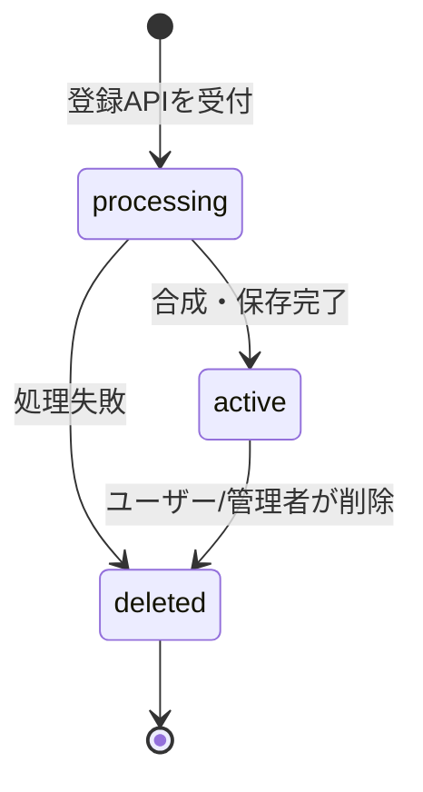

# プロジェクト用語集 (Glossary)

## 概要

このドキュメントは、LGTMHubプロジェクト内で使用される用語の定義を管理します。
すべてのドキュメント・コード・コミュニケーションでの用語の統一を目的とします。

**更新日**: 2026-05-02

---

## ドメイン用語

プロジェクト固有のビジネス概念や機能に関する用語。

### LGTM (Looks Good To Me)

**定義**: コードレビューで「問題なし、マージしてよい」を意味する英語表現の頭字語。

**説明**:
プルリクエストのApproveコメントとして広く使われる。本サービスはこの「LGTM」をテキストではなく画像で表現する文化を支援する。

**使用例**:
- 「LGTM画像を貼ってApproveする」
- 「LGTMコメントだけだと味気ない」

**英語表記**: Looks Good To Me

---

### LGTM画像

**定義**: 元画像の上に「LGTM」の文字を合成した画像。コードレビューのApprove時にマークダウンリンクとして貼り付けて利用する。

**説明**:
本サービスでは、ユーザーが指定した画像URLから画像をダウンロードし、白文字+黒縁の「LGTM」文字をSharpで合成、WebP形式で Vercel Blob に保存する。マークダウン形式 `` で簡単にコピーできる。

**関連用語**: [LGTM文字合成](#lgtm文字合成), [pHash](#phash-perceptual-hash)

**データモデル**: `src/types/image.ts` の `LgtmImage` インターフェース

**英語表記**: LGTM Image

---

### LGTM文字合成

**定義**: 元画像の上に視認性の高い「LGTM」テキスト（白文字+黒縁固定）を重ねる処理。

**説明**:
lgtmoon.comの「白文字一択で背景によっては読めない」という課題を解決するため、白文字に黒縁（stroke）を必ず付ける仕様。SharpのSVGオーバーレイ機能で実装する。

**関連用語**: [LGTM画像](#lgtm画像), [Sharp](#sharp)

**実装箇所**: `src/lib/image/compose-lgtm.ts`

**英語表記**: LGTM Text Composition

---

### マークダウンリンク

**定義**: LGTM画像をPR等に貼り付けるためのMarkdown形式のリンク文字列。

**フォーマット**:
```markdown

```

**説明**:
画像一覧画面の各画像にコピーボタンが配置されており、クリックでクリップボードにコピーされる。ログインなしでもコピー可能。

**使用例**:
- 「マークダウンリンクをコピーしてApproveに貼る」

---

### お気に入り

**定義**: ユーザーが頻繁に使う画像にマークを付けて、後から素早く見つけられるようにする機能。PRDでは機能4として定義され、サブ機能 4-A（登録・解除）と 4-B（一覧画面）から構成される。

**説明**:
- ログイン済みユーザーのみ利用可能
- 自分が登録した画像でなくてもお気に入り登録できる
- お気に入りリストは本人のみ閲覧可能（非公開）

**サブ機能**:
- **4-A 登録・解除**: `POST /api/favorites` / `DELETE /api/favorites/:lgtmImageId`
- **4-B 一覧画面**: `GET /api/favorites`、専用ページ `/favorites`

**関連用語**: [Favorite](#favorite-お気に入りエンティティ)

**データモデル**: `src/types/favorite.ts` の `Favorite` インターフェース

**英語表記**: Favorite

---

### 画像登録

**定義**: ユーザーが画像URLを入力し、LGTM文字を合成した画像を本サービスに保存する操作。

**説明**:
- ログイン必須
- 1ユーザーあたり1日10枚まで
- 同じ画像（pHashが類似）は重複登録不可
- 処理は非同期（処理中表示→完了通知）

**関連用語**: [pHash](#phash-perceptual-hash), [日次登録上限](#日次登録上限)

**実装箇所**: `src/services/image-service.ts` の `createImage` メソッド

---

### 日次登録上限

**定義**: 1ユーザーが1日に登録できるLGTM画像の最大数。MVPでは10枚。

**説明**:
ホゲータ問題（同一テーマの画像を大量生成される）を防ぐためのレート制限。`daily_upload_counts` テーブルで日付ごとにカウントを管理する。

**関連用語**: [DailyUploadCount](#dailyuploadcount)

**実装箇所**: `src/repositories/daily-upload-count-repository.ts`

---

### 通報機能（P1）

**定義**: 不適切と思われる画像をユーザーが管理者に報告する機能。

**説明**:
P1機能。**5件以上の通報** を受けた画像は自動的に非表示（レビュー待ち）になり、管理者が確認の上で削除する。同一ユーザーが同一画像に対して通報できるのは1回のみ。閾値はMVP後に実データを見て調整可能。

**関連用語**: [管理者削除](#管理者削除p1)

---

### 管理者削除（P1）

**定義**: 管理者ロールを持つユーザーが、任意のユーザーの画像を削除できる機能。

**説明**:
P1機能。`user_profiles.is_admin = true` のユーザーのみ実行可能。RLSとアプリケーションレベルの両方で権限チェックする。

**関連用語**: [通報機能](#通報機能p1), [RLS](#rls-row-level-security)

---

### ホゲータ問題

**定義**: 同一テーマや同一画像が大量に登録され、画像一覧の多様性が失われる現象を指す本プロジェクトの俗称。

**説明**:
lgtmoon.comで実際に起きている問題。「ポケットモンスターのホゲータの亜種画像」が大量に生成されている事例から命名。本サービスではpHashによる重複チェックと日次登録上限で対策する。

**関連用語**: [pHash](#phash-perceptual-hash), [日次登録上限](#日次登録上限)

---

## 技術用語

### Next.js

**定義**: Vercel社が開発するReactベースのフルスタックフレームワーク。

**公式サイト**: https://nextjs.org/

**本プロジェクトでの用途**:
- App Routerによるファイルベースルーティング
- Server / Client Components の使い分け
- Route Handlers でAPIエンドポイントを実装
- 画像最適化（next/image）

**バージョン**: 15.x

**設定ファイル**: `next.config.ts`

---

### React

**定義**: Meta社が開発するUIライブラリ。

**公式サイト**: https://react.dev/

**本プロジェクトでの用途**: 画面UIの構築。Next.js 15 が要求する React 19 系を使用し、Server Components を活用する。

**バージョン**: 19.x

---

### Supabase

**定義**: Firebaseのオープンソース代替を目指すBaaS。PostgreSQL・認証・ストレージ・Realtimeを統合提供する。

**公式サイト**: https://supabase.com/

**本プロジェクトでの用途**:
- PostgreSQLデータベース（メタデータ保存）
- GitHub OAuth認証（Auth）
- Row Level Security（RLS）によるアクセス制御

**SDK**: `@supabase/supabase-js` 2.x, `@supabase/ssr` 0.5.x

**選定理由**: GitHub OAuthが標準対応、RLSでセキュアなアクセス制御、無料枠あり

---

### Vercel Blob

**定義**: Vercelが提供するオブジェクトストレージサービス。CDN配信が標準で組み込まれている。

**公式サイト**: https://vercel.com/docs/storage/vercel-blob

**本プロジェクトでの用途**: LGTM合成済み画像本体の保存・配信。

**SDK**: `@vercel/blob` 0.27.x

**選定理由**: Vercelとの統合が容易、CDN配信が自動、無料枠1GB/月

---

### Sharp

**定義**: Node.js向けの高速な画像処理ライブラリ。libvipsベース。

**公式サイト**: https://sharp.pixelplumbing.com/

**本プロジェクトでの用途**:
- LGTM文字のSVGオーバーレイ合成
- WebP形式への変換
- 幅1200px以内へのリサイズ
- pHash計算（32x32グレースケール変換）

**バージョン**: 0.34.x

**実装箇所**: `src/lib/image/`

---

### zod

**定義**: TypeScriptファーストのスキーマ宣言・バリデーションライブラリ。

**公式サイト**: https://zod.dev/

**本プロジェクトでの用途**: API Route Handler でのリクエストボディ検証。

**バージョン**: 3.x

**例**:
```typescript
const createImageSchema = z.object({
  imageUrl: z.string().url().startsWith('https://').max(2048),
});
```

---

### Tailwind CSS

**定義**: ユーティリティファーストのCSSフレームワーク。

**公式サイト**: https://tailwindcss.com/

**本プロジェクトでの用途**: コンポーネントスタイリング全般。

**バージョン**: 4.x

---

### Vitest

**定義**: Viteベースのモダンなユニットテストフレームワーク。

**公式サイト**: https://vitest.dev/

**本プロジェクトでの用途**: ユニットテスト・統合テストの実行。

**バージョン**: 3.x

**設定ファイル**: `vitest.config.ts`

---

### Playwright

**定義**: Microsoft開発のE2Eテストフレームワーク。複数ブラウザに対応。

**公式サイト**: https://playwright.dev/

**本プロジェクトでの用途**: E2Eテスト（画像登録・お気に入り・コピー操作の検証）。

**バージョン**: 1.5x

**設定ファイル**: `playwright.config.ts`

---

## 略語・頭字語

### PRD

**正式名称**: Product Requirements Document

**意味**: プロダクト要求定義書。プロダクトの「何を作るか」を定義するドキュメント。

**本プロジェクトでの使用**: `docs/product-requirements.md`

---

### MVP

**正式名称**: Minimum Viable Product

**意味**: 実用最小限の製品。価値検証のために必要最低限の機能だけを備えた初期リリース版。

**本プロジェクトでの使用**: P0機能（画像登録・削除・OAuth認証・お気に入り・一覧）が MVP に該当。

---

### MAU

**正式名称**: Monthly Active Users

**意味**: 月間アクティブユーザー数。1ヶ月間にサービスを利用したユニークユーザーの数。

**本プロジェクトでの使用**: プライマリーKPI。

---

### OAuth

**正式名称**: Open Authorization

**意味**: ユーザーが第三者サービスに自身のリソースへのアクセス権限を委譲するための認可プロトコル。

**本プロジェクトでの使用**: GitHub OAuth でユーザーログインを実装。Supabase Auth経由で利用。

---

### CDN

**正式名称**: Content Delivery Network

**意味**: コンテンツを地理的に分散配置されたサーバーから配信し、エンドユーザーへの配信を高速化する仕組み。

**本プロジェクトでの使用**: Vercel Blob と Vercel Edge Network で画像と静的アセットを配信。

---

### LCP

**正式名称**: Largest Contentful Paint

**意味**: Web Vitals の指標の1つ。ページ内で最大のコンテンツ要素（画像・テキストブロック等）が表示完了するまでの時間。ユーザーが「ページが表示された」と感じるタイミングに最も近い指標とされる。

**本プロジェクトでの使用**: 画像一覧・画像詳細ページのパフォーマンス目標値（3秒以内・2秒以内）の測定指標。Lighthouse / Vercel Analytics で計測する。

**参考**: [docs/architecture.md#パフォーマンス要件](./architecture.md#パフォーマンス要件)

---

### RLS

**正式名称**: Row Level Security

**意味**: PostgreSQLの機能。テーブルの行単位でアクセス制御ポリシーを設定できる。

**本プロジェクトでの使用**: Supabase の全テーブルで有効化し、認証ユーザーが自分のデータのみアクセス可能なポリシーを設定。

**参考**: [docs/architecture.md#セキュリティアーキテクチャ](./architecture.md#セキュリティアーキテクチャ)

---

### SSRF

**正式名称**: Server-Side Request Forgery

**意味**: サーバーサイドのHTTPリクエスト機能を悪用して、本来アクセスすべきでない内部リソースへリクエストを送信させる攻撃。

**本プロジェクトでの使用**:
画像URL登録機能で外部URLを取得する際、攻撃者がプライベートIP（`10.0.0.0/8` など）を指定することで内部リソースを侵害できる可能性がある。
対策として `src/lib/http/safe-fetch.ts` でDNS解決後にIPを検証し、プライベートIPへのアクセスをブロックする。

**実装箇所**: `src/lib/http/safe-fetch.ts`

---

### CI/CD

**正式名称**: Continuous Integration / Continuous Delivery (Deployment)

**意味**: コード変更を自動でテスト・ビルド・デプロイする仕組み。

**本プロジェクトでの使用**: GitHub Actions による Lint / 型チェック / テスト / E2E、Vercel による自動デプロイ。

---

## アーキテクチャ用語

### レイヤードアーキテクチャ

**定義**: システムを役割ごとに複数の層に分割し、上位層から下位層への一方向の依存関係を持たせる設計パターン。

**本プロジェクトでの適用**:

```
Presentation Layer (app/)
    ↓
API Layer (app/api/)
    ↓
Service Layer (src/services/)
    ↓
Data Layer (src/repositories/)
```

**各層の責務**:
- Presentation Layer: 画面描画、ユーザー入力受付
- API Layer: HTTP境界、認証、入力検証、エラー変換
- Service Layer: ビジネスロジック
- Data Layer: DB / Blob / 外部HTTPアクセス

**禁止される依存**:
- Data → Service ❌
- Service → API ❌
- Service → Presentation ❌
- 下位レイヤー → 上位レイヤー ❌

**参考**: [docs/architecture.md#アーキテクチャパターン](./architecture.md#アーキテクチャパターン)

---

### Server Component

**定義**: Next.js App Router で、サーバーサイドのみで実行される React コンポーネント。

**本プロジェクトでの適用**:
- `app/` 配下のコンポーネントはデフォルトで Server Component
- 直接 `src/services/` を呼び出しできる
- ブラウザ側のJSバンドルに含まれない（ビルドサイズが小さくなる）

**関連用語**: [Client Component](#client-component)

---

### Client Component

**定義**: ブラウザ側でも実行されるReactコンポーネント。`'use client'` ディレクティブを先頭に付けて宣言する。

**本プロジェクトでの適用**:
- `useState` / `useEffect` などのフックを使うコンポーネント
- ユーザーインタラクション（クリック・入力）を扱うコンポーネント
- 例: マークダウンコピーボタン、お気に入りボタン

**関連用語**: [Server Component](#server-component)

---

### Route Handler

**定義**: Next.js App Router におけるAPIエンドポイント実装の仕組み。`app/api/*/route.ts` に配置する。

**本プロジェクトでの適用**:
- `GET` / `POST` / `DELETE` などのHTTPメソッドを named export で定義
- 認証チェック、zodバリデーション、Service呼び出し、エラー変換を担当

**例**:
```typescript
// app/api/images/route.ts
export async function POST(request: NextRequest) { /* ... */ }
```

---

## ステータス・状態

### 画像ステータス (Image Status)

**定義**: LGTM画像のライフサイクル状態を示す列挙型。

**取りうる値**:

| ステータス | 意味 | 遷移条件 | 次の状態 |
|----------|------|---------|---------|
| `processing` | 登録処理中（合成・保存中） | 画像登録APIを受け付けた直後 | `active`, `deleted` |
| `active` | 公開中（一覧に表示される） | 合成・保存が完了 | `deleted` |
| `deleted` | 論理削除済み（一覧に表示されない） | ユーザーまたは管理者が削除 | （終端） |

**状態遷移図**:


**実装**:
```typescript
// src/types/image.ts
export type ImageStatus = 'processing' | 'active' | 'deleted';
```

---

## データモデル用語

### LgtmImage

**定義**: LGTM画像のメタデータを表すエンティティ。

**主要フィールド**:
- `id`: UUID
- `uploaderId`: 登録者のユーザーID
- `originalUrl`: 元画像のURL
- `imageUrl`: Vercel Blob上の合成済み画像URL
- `pHash`: 知覚ハッシュ（重複検出用）
- `status`: `processing` / `active` / `deleted`

**関連エンティティ**: [UserProfile](#userprofile), [Favorite](#favorite-お気に入りエンティティ)

**制約**: `pHash` にINDEX、`uploader_id` は `user_profiles.id` への外部キー

**データソース**: `lgtm_images` テーブル / `src/types/image.ts`

---

### UserProfile

**定義**: Supabase Authが管理するユーザー情報を補完するプロフィールエンティティ。

**主要フィールド**:
- `id`: Supabase Auth の UUID
- `githubLogin`: GitHubユーザー名（UNIQUE）
- `displayName`: 表示名
- `avatarUrl`: アバター画像URL
- `isAdmin`: 管理者フラグ

**関連エンティティ**: [LgtmImage](#lgtmimage), [Favorite](#favorite-お気に入りエンティティ)

**データソース**: `user_profiles` テーブル / `src/types/user.ts`

---

### Favorite (お気に入りエンティティ)

**定義**: ユーザーと画像のお気に入り関係を表すエンティティ。

**主要フィールド**:
- `id`: UUID
- `userId`: ユーザーID
- `lgtmImageId`: LGTM画像ID
- `createdAt`: 作成日時

**制約**: `(user_id, lgtm_image_id)` にUNIQUE制約

**データソース**: `favorites` テーブル / `src/types/favorite.ts`

---

### DailyUploadCount

**定義**: ユーザーごとの日次画像登録数を記録するエンティティ。レート制限のために使用。

**主要フィールド**:
- `userId`: ユーザーID
- `date`: 日付（'YYYY-MM-DD'形式）
- `count`: その日の登録数

**制約**: `(user_id, date)` にUNIQUE制約、`count` の上限は10

**データソース**: `daily_upload_counts` テーブル

---

## エラー・例外

### NotFoundError

**クラス名**: `NotFoundError`

**継承元**: `AppError` （`src/lib/errors.ts`）

**発生条件**: 指定されたIDのリソースがDB上に存在しない場合。

**HTTPマッピング**: 404 Not Found

**例**:
```typescript
throw new NotFoundError('LgtmImage', id);
```

---

### DuplicateImageError

**クラス名**: `DuplicateImageError`

**継承元**: `AppError`

**発生条件**: 画像登録時に、pHashが既存画像と類似（ハミング距離10以下）と判定された場合。

**HTTPマッピング**: 409 Conflict

**応答に含まれる情報**: `existingImageId`（既存画像のID、リダイレクト先として使用）

**例**:
```typescript
throw new DuplicateImageError(existingImage.id);
```

---

### DailyLimitExceededError

**クラス名**: `DailyLimitExceededError`

**継承元**: `AppError`

**発生条件**: ユーザーが当日10枚目を超えて画像を登録しようとした場合。

**HTTPマッピング**: 429 Too Many Requests

**例**:
```typescript
if (count >= MAX_DAILY_UPLOADS) {
  throw new DailyLimitExceededError();
}
```

---

### BadRequestError

**クラス名**: `BadRequestError`

**継承元**: `AppError`

**発生条件**:
- 画像URLが無効（取得失敗・対応外フォーマット・サイズ超過）
- SSRF対策でブロックされたURL（プライベートIP等）

**HTTPマッピング**: 400 Bad Request

---

## アルゴリズム用語

### pHash (Perceptual Hash)

**定義**: 画像の知覚的特徴をビット列に変換するハッシュアルゴリズム。視覚的に類似する画像は近いハッシュ値を持つ。

**本プロジェクトでの用途**: 重複画像の検出。

**計算方法**:
1. 画像を 32x32 のグレースケールにリサイズ
2. 全ピクセルの平均値を計算
3. 各ピクセルが平均以上なら `1`、未満なら `0` のビット列を生成（1024ビット）

**判定基準**: ハミング距離 ≤ 10 で「同一画像」と判定

**実装箇所**: `src/lib/image/calculate-phash.ts`

**関連用語**: [ハミング距離](#ハミング距離-hamming-distance)

**英語表記**: Perceptual Hash

---

### ハミング距離 (Hamming Distance)

**定義**: 同じ長さの2つのビット列の間で、対応する位置のビットが異なる箇所の数。

**本プロジェクトでの用途**: pHashの類似度判定。

**計算式**:
```
HammingDistance(a, b) = count(i for i in 0..len(a) if a[i] != b[i])
```

**判定閾値**: 1024ビット中 10ビット以内の差異 → 同一画像とみなす（`DUPLICATE_THRESHOLD = 10`）

**実装箇所**: `src/lib/image/calculate-phash.ts`

**英語表記**: Hamming Distance

---

## ドキュメント用語

### 永続ドキュメント

**定義**: プロジェクト全体で長期的に維持される設計ドキュメント。`docs/` 配下に配置。

**対象ファイル**:
- `product-requirements.md` (PRD)
- `functional-design.md` (機能設計書)
- `architecture.md` (アーキテクチャ設計書)
- `repository-structure.md` (リポジトリ構造定義書)
- `development-guidelines.md` (開発ガイドライン)
- `glossary.md` (用語集 - 本ドキュメント)

**関連用語**: [ステアリングファイル](#ステアリングファイル)

---

### ステアリングファイル

**定義**: 特定の開発作業における「今回何をするか」を定義する一時的なドキュメント。

**配置先**: `.steering/[YYYYMMDD]-[task-name]/`

**含まれるファイル**:
- `requirements.md`: 今回の作業の要求内容
- `design.md`: 変更内容の設計
- `tasklist.md`: タスクリスト

**関連用語**: [永続ドキュメント](#永続ドキュメント)

---

## 索引

### あ行
- [アーカイブ](#画像ステータス-image-status) - 画像ステータス
- [お気に入り](#お気に入り) - ドメイン用語

### か行
- [画像登録](#画像登録) - ドメイン用語
- [画像ステータス](#画像ステータス-image-status) - 状態
- [管理者削除](#管理者削除p1) - ドメイン用語

### さ行
- [Sharp](#sharp) - 技術用語
- [Server Component](#server-component) - アーキテクチャ
- [Supabase](#supabase) - 技術用語
- [ステアリングファイル](#ステアリングファイル) - ドキュメント用語

### た行
- [通報機能](#通報機能p1) - ドメイン用語

### な行
- [Next.js](#nextjs) - 技術用語
- [日次登録上限](#日次登録上限) - ドメイン用語

### は行
- [Playwright](#playwright) - 技術用語
- [pHash](#phash-perceptual-hash) - アルゴリズム
- [ハミング距離](#ハミング距離-hamming-distance) - アルゴリズム
- [ホゲータ問題](#ホゲータ問題) - ドメイン用語

### ま行
- [マークダウンリンク](#マークダウンリンク) - ドメイン用語

### ら行
- [LGTM画像](#lgtm画像) - ドメイン用語
- [LGTM文字合成](#lgtm文字合成) - ドメイン用語
- [Route Handler](#route-handler) - アーキテクチャ
- [レイヤードアーキテクチャ](#レイヤードアーキテクチャ) - アーキテクチャ

### A-Z
- [CDN](#cdn) - 略語
- [CI/CD](#cicd) - 略語
- [Client Component](#client-component) - アーキテクチャ
- [LCP](#lcp) - 略語
- [LGTM](#lgtm-looks-good-to-me) - 略語
- [MAU](#mau) - 略語
- [MVP](#mvp) - 略語
- [OAuth](#oauth) - 略語
- [PRD](#prd) - 略語
- [React](#react) - 技術用語
- [RLS](#rls-row-level-security) - 略語
- [SSRF](#ssrf) - 略語
- [Tailwind CSS](#tailwind-css) - 技術用語
- [Vercel Blob](#vercel-blob) - 技術用語
- [Vitest](#vitest) - 技術用語
- [zod](#zod) - 技術用語
